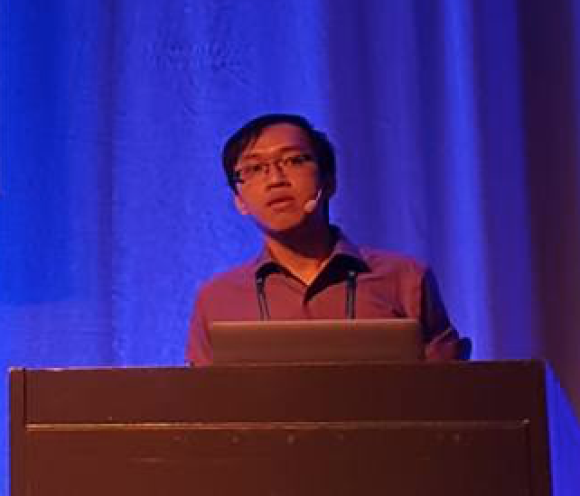

<!--  -->

# Nghi D. Q. BUI  

Ph.D. Student, Information Systems  
Singapore Management University  
<em>Curriculum Vitae: </em><a href="/files/CV_new.pdf" target="_blank">PDF</a>  <small>(April, 2017)</small>  
<em>Email: </em><a>dqnbui dot 2016 at phdis dot smu dot edu dot sg</a> | <a>bdqnghi at gmail dot com</a>  
<em>Office: </em>Block 18, Level 4, SIS Research Center, School of Information Systems, Singapore Management University 
<!-- 
<a href="http://doodle.com/dhawaljoh" target="_blank">Meet me!</a> | <a href="http://flask.io/yoUm1" target="_blank">Assign me a task!</a> (please let me know you've added something!)
 -->

## About Me
<!--  -->

Hi, welcome to my personal page. I'm a second year Ph.D Student at <a href="https://sis.smu.edu.sg/programmes/PhD/overview" target="_blank">School of Information Systems, Singapore Management University</a>. At SIS, I'm fortunate to be advised by <a href="http://www.mysmu.edu/faculty/lxjiang/" target="_blank">Prof. Lingxiao Jiang</a>. 

## Background

I obtained a Bachelor Degree in <a href="http://www.apcs.hcmus.edu.vn/Default.aspx?alias=www.apcs.hcmus.edu.vn/en" target="_blank">Advanced Program Computer Science</a>, which is a honour program at <a href="http://web.hcmus.edu.vn/en/index.php" target="_blank">Ho Chi Minh University of Science</a>. At HCMUS, I conducted my thesis under the supervision of <a href="https://dblp.org/pers/hd/d/Dinh:Tien_Ba">Prof. Dinh Ba Tien</a>. After that, I worked as a software engineer in the industry for 3 years.

## Research Interests

My interests lie at the intersection of Software Mining, Natural Language Processing, and Machine Learning. Concretely, I am interested in employing the power of Machine Learning to software engineering and programming languages to solve challenging software engineering problem.

## Projects
### Program Representation Learning

I'm focusing on employing the theory of graph-based and tree-based deep learning to learn the representation of software program (or code modeling). Programming languages, as well as natural languages, are both considered as the sequence of text. But the programming languages expose a richer structural information in a form of the Abstract Syntax Tree (AST). In addition, the elements in the AST are well-connected with each other through many form of dependencies, such as def-use, control flow, data flow. As such, the source code of programming languages can also be described in the form of graphs, where the edges in the graph represent for  different type of relations between the elements. This leads to the consequence that modeling source code using a tree-based model or graph-based model usually can produce richer and more useful features than the sequence-based model. The features extracted can be useful in tasks, such as program classification, variable naming, variable misuse detection, etc.

### Unsupervised Cross-Domains Adaptation

I'm also interested in working with the cross-domain problems. The cross-domain problems are the ones which involve 2 or more domains in a learning task, in which the cross-domains can be cross-languages, cross-projects, or cross code and text modeling, e.g programming language translation, cross-language API mappings, cross-language program classification, etc.  Usually, to adapt 2 domains, e.g mapping APIs from one language into another, transferring bug prediction model learn from a project to another, etc, one needs a lot of parallel data to build the cross-domains model. Such parallel data may not available all the time, and requires a lot of human effort to label the data, which can be seen as a lot of prior knowledge to build the model. As such, there is a need for the techniques that can adapt the domains with at least prior knowledge as possible, or without prior knowledge at all.

### Building Interpretability Blocks for Program Representation Learning

As the third wave of AI is coming, someday the computer will have the ability to program itself. Program representation learning is one of the core technique to reach such a goal. Many techniques have been proposed to learn the representation of the program, but lack of the interpretable ability. As a result, no one understands how the Deep Learning model for program representation works, which resulting in the hesitation to adopt such techniques to solve real-world problems. To bridge this gap, the need to build the interpretable neural networks for program representation is obvious. We hypothesize that to build such an interpretable mechanism, this mechanism should be built around the structural representation of the source code, e.g Abstract Syntax Tree.

## Keywords

source code modeling, natural language processing, API translation, tree-based learning, graph-based learning, neural networks

Full list of my publications can be found <a href="https://scholar.google.com.sg/citations?user=QwybxYsAAAAJ&hl=ens" target="_blank">here</a>.
 

